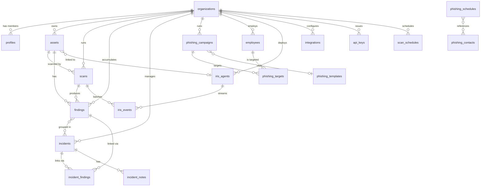

# Data Models

This document is the authoritative reference for the Horus database schema. It covers every production table, the multi-tenant isolation strategy, the global soft-delete pattern, and the key indexes and their rationale.

---

## 1. Database Overview

Horus runs on **Supabase Postgres** (Postgres 15+). All application tables live in the public schema. Supabase Auth manages user identity in the `auth` schema; the application extends it with the `profiles` table.

### Multi-tenancy

Every data table carries an `org_id uuid` column that references `organizations(id)`. Tenant isolation is enforced at the database level through **Row Level Security (RLS)**. All tables have RLS enabled. The helper function `current_org_id()` is the single source of truth:

```sql
create or replace function current_org_id()
returns uuid as $$
  select org_id from profiles where id = auth.uid()
$$ language sql security definer;
```

RLS policies take the form `using (org_id = current_org_id())`. Bearer-token (Supabase JWT) clients automatically satisfy this check. API-key clients use the service-role client, which bypasses RLS; those callers must supply the correct `org_id` manually, which the backend enforces in every query.

### Soft Deletes

No user-managed row is ever physically removed through the API. See [Section 4](#4-soft-delete-pattern) for the full explanation.

---

## 2. Entity Reference

### 2.1 `organizations`

Top-level tenant. Created once per customer account.

| Column | Type | Notes |
|---|---|---|
| `id` | uuid PK | Generated by `gen_random_uuid()` |
| `name` | text NOT NULL | Display name |
| `domain` | text | Primary email domain; used by HIBP checks |
| `settings` | jsonb | Tenant-level feature flags and preferences |
| `created_at` | timestamptz | Default `now()` |

RLS: organizations are not themselves row-level-isolated (each user's JWT already scopes them to one org). Physical deletes are intentional: removing an org cascades through every foreign key.

---

### 2.2 `profiles`

Extends Supabase `auth.users` with org membership and role.

| Column | Type | Notes |
|---|---|---|
| `id` | uuid PK | FK to `auth.users(id)`, cascades on delete |
| `org_id` | uuid | FK to `organizations(id)`, cascades on delete |
| `role` | text | `admin`, `analyst`, or `viewer` |
| `full_name` | text | Display name shown in the UI |
| `created_at` | timestamptz | Default `now()` |
| `deleted_at` | timestamptz | Soft-delete timestamp; NULL means active |

RLS policy `org_read` (FOR SELECT): `org_id = current_org_id() and deleted_at is null`.

One profile per user. The role drives the backend `require_role()` dependency guard.

---

### 2.3 `assets`

Represents a scannable target. This is the central entity: scans, findings, and Iris agents all reference it.

| Column | Type | Notes |
|---|---|---|
| `id` | uuid PK | |
| `org_id` | uuid NOT NULL | FK to `organizations` |
| `name` | text NOT NULL | Human label |
| `host` | text NOT NULL | Hostname, IP, or URL |
| `port` | integer | Optional; overrides protocol default |
| `type` | text NOT NULL | `web`, `ip`, `api`, `domain`, or `cloud` |
| `is_internal` | boolean | Default `false`; skips public-IP validation |
| `is_active` | boolean | Default `true`; inactive assets are excluded from scan-all |
| `tags` | text[] | Free-form tags for grouping |
| `metadata` | jsonb | Arbitrary extra fields |
| `created_at` | timestamptz | |
| `deleted_at` | timestamptz | Soft-delete; RLS hides non-null rows |

The `cloud` type was added in migration `20260621120000_cloud_assets` to support AWS account assets. Cloud credentials are stored in `integrations` (type `aws`), not on the asset itself.

RLS policy `org_isolation`: `org_id = current_org_id() and deleted_at is null`.

---

### 2.4 `scans`

A single scan execution against one asset. Created by the API and processed by the Horus pipeline.

| Column | Type | Notes |
|---|---|---|
| `id` | uuid PK | |
| `org_id` | uuid NOT NULL | FK to `organizations` |
| `asset_id` | uuid NOT NULL | FK to `assets`, cascades on delete |
| `schedule_id` | uuid | FK to `scan_schedules`; null for manual scans |
| `status` | text NOT NULL | `pending`, `running`, `completed`, `failed`, or `canceled` |
| `tools_used` | text[] | e.g. `{nuclei, nmap}` |
| `triggered_by` | text | `user:<uuid>` or `schedule` |
| `triggered_by_user_id` | uuid | Denormalized user ID for label lookups |
| `raw_output` | jsonb | Raw scanner output (debug only) |
| `error_message` | text | Populated on failure or cancellation |
| `started_at` | timestamptz | Null until the worker picks it up |
| `completed_at` | timestamptz | Null until terminal state |
| `created_at` | timestamptz | |

The `triggered_by_label` field seen in API responses is a computed Python string, not a database column. The backend derives it by joining `triggered_by` with `profiles.full_name`.

---

### 2.5 `findings`

Deduplicated vulnerabilities discovered by scans or imported manually. This is the most queried table in the system.

| Column | Type | Notes |
|---|---|---|
| `id` | uuid PK | |
| `org_id` | uuid NOT NULL | FK to `organizations` |
| `scan_id` | uuid | FK to `scans`; null for manually imported findings |
| `asset_id` | uuid NOT NULL | FK to `assets` |
| `title` | text NOT NULL | Short vulnerability description |
| `description` | text | Full explanation |
| `severity` | text NOT NULL | `critical`, `high`, `medium`, `low`, or `info` |
| `cvss_score` | numeric(4,1) | CVSS v3 base score |
| `cve_ids` | text[] | Associated CVE identifiers |
| `status` | text NOT NULL | `open`, `in_progress`, `resolved`, `false_positive`, or `accepted_risk` |
| `fingerprint` | text NOT NULL | SHA-256 of title + host + source (first 32 chars). Unique per org. |
| `is_noise` | boolean | True for absence/informational findings (hidden by default) |
| `raw_data` | jsonb | Scanner-specific payload including `cvss_v3_score` and `tool` |
| `first_seen_at` | timestamptz | Set on first insert; never overwritten |
| `last_seen_at` | timestamptz | Updated on every re-import or re-scan |
| `created_at` | timestamptz | |
| `severity_rank` | int GENERATED STORED | `0=critical, 1=high, 2=medium, 3=low, 4=info`. Added in `20260622090000_findings_severity_rank`. |

**Deduplication:** upserts use the unique constraint on `(org_id, fingerprint)`. Re-importing the same finding updates `last_seen_at` without creating a duplicate.

**Noise filter:** findings where `is_noise = true` are hidden from list/detail responses unless the caller passes `include_noise=true`. The API also returns a `noise_count` field so the UI can display a "N hidden" banner.

**Severity ordering:** `severity_rank` solves the problem that ordering by the `severity` text column sorts alphabetically (`critical, high, info, low, medium`) rather than by actual risk. The generated column enables correct risk-order sorts via `order("severity_rank")`.

RLS policy `org_isolation`: `org_id = current_org_id()`. No soft-delete on findings; they accumulate over time.

---

### 2.6 `incidents`

Groups related findings under a single owner with a status lifecycle and SLA. Used for case management.

| Column | Type | Notes |
|---|---|---|
| `id` | uuid PK | |
| `org_id` | uuid NOT NULL | FK to `organizations` |
| `title` | text NOT NULL | |
| `description` | text | |
| `status` | text NOT NULL | `open`, `in_progress`, `resolved`, or `closed` |
| `severity` | text NOT NULL | `critical`, `high`, `medium`, or `low` |
| `assignee_id` | uuid | FK to `auth.users`; set null on user deletion |
| `sla_deadline` | timestamptz | Nullable; shown as overdue in the UI when past |
| `created_by` | uuid | FK to `auth.users` |
| `closed_at` | timestamptz | Stamped when status transitions to `closed` |
| `created_at` | timestamptz | |
| `updated_at` | timestamptz | Maintained by the `incidents_updated_at` trigger |

Incidents do not have a `deleted_at` column. Deletion through the API sets `status = closed`.

---

### 2.7 `incident_findings`

Many-to-many join between `incidents` and `findings`.

| Column | Type | Notes |
|---|---|---|
| `incident_id` | uuid | FK to `incidents`, cascades on delete |
| `finding_id` | uuid | FK to `findings`, cascades on delete |
| `added_at` | timestamptz | |
| `deleted_at` | timestamptz | Soft-delete; set to unlink a finding without losing the history |

Primary key: `(incident_id, finding_id)`. Upsert on this PK allows relinking a previously soft-deleted association.

RLS: inherits org scope through the parent incident. The policy checks `exists (select 1 from incidents where id = incident_id and org_id = current_org_id()) and deleted_at is null`.

---

### 2.8 `incident_notes`

Append-only activity log per incident.

| Column | Type | Notes |
|---|---|---|
| `id` | uuid PK | |
| `incident_id` | uuid NOT NULL | FK to `incidents`, cascades on delete |
| `author_id` | uuid NOT NULL | FK to `auth.users`, cascades on delete |
| `body` | text NOT NULL | Markdown-safe free text, max 10,000 chars |
| `created_at` | timestamptz | |

No updates or deletes. Notes are returned in chronological order.

---

### 2.9 `phishing_campaigns`

Top-level entity for a phishing simulation campaign.

| Column | Type | Notes |
|---|---|---|
| `id` | uuid PK | |
| `org_id` | uuid NOT NULL | FK to `organizations` |
| `name` | text NOT NULL | |
| `objective` | text NOT NULL | `click`, `credentials`, or `report` |
| `status` | text | `draft`, `scheduled`, `running`, or `completed` |
| `context_asset_ids` | uuid[] | Assets whose context informs AI-generated emails |
| `schedule_cron` | text | Optional cron; null for one-shot campaigns |
| `template_id` | uuid | FK to `phishing_templates`; null uses AI generation |
| `launched_at` | timestamptz | Stamped when the campaign transitions to `running` |
| `completed_at` | timestamptz | |
| `created_by` | uuid | FK to `auth.users` |
| `created_at` | timestamptz | |
| `deleted_at` | timestamptz | Soft-delete |

---

### 2.10 `phishing_contacts`

Reusable recipient list for scheduled phishing campaigns. Distinct from `employees`: contacts are used by the scheduler without requiring an employee record.

| Column | Type | Notes |
|---|---|---|
| `id` | uuid PK | |
| `org_id` | uuid NOT NULL | FK to `organizations` |
| `name` | text NOT NULL | |
| `email` | text NOT NULL | |
| `department` | text | |
| `created_at` | timestamptz | |

Unique constraint: `(org_id, email)`.

---

### 2.11 `phishing_schedules`

Recurring phishing schedule (cron-based). Stores a list of contact IDs and context asset IDs as arrays.

| Column | Type | Notes |
|---|---|---|
| `id` | uuid PK | |
| `org_id` | uuid NOT NULL | FK to `organizations` |
| `name` | text NOT NULL | |
| `cron_expression` | text NOT NULL | Standard cron syntax |
| `objective` | text NOT NULL | `click`, `credentials`, or `report` |
| `contact_ids` | uuid[] | References to `phishing_contacts.id` |
| `context_asset_ids` | uuid[] | References to `assets.id` |
| `enabled` | boolean | Default `true` |
| `created_at` | timestamptz | |

---

### 2.12 `phishing_templates`

HTML email templates used in phishing campaigns. Can be org-private or publicly shared in the community library.

| Column | Type | Notes |
|---|---|---|
| `id` | uuid PK | |
| `org_id` | uuid NOT NULL | FK to `organizations` |
| `name` | text NOT NULL | |
| `subject` | text | Email subject line |
| `body_html` | text | Full HTML email body with `{{tracking_url}}` placeholder |
| `is_public` | boolean | `true` makes the template visible in the community library |
| `created_by` | uuid | FK to `auth.users` |
| `created_at` | timestamptz | |
| `deleted_at` | timestamptz | Soft-delete |

Two RLS policies: `org_isolation` for private read/write (`org_id = current_org_id() and deleted_at is null`) and `phishing_templates_read_public` for the community library (`is_public = true and deleted_at is null`).

---

### 2.13 `employees`

Org members targeted in phishing campaigns. Also linked to HIBP breach data.

| Column | Type | Notes |
|---|---|---|
| `id` | uuid PK | |
| `org_id` | uuid NOT NULL | FK to `organizations` |
| `email` | text NOT NULL | Lowercased on insert |
| `full_name` | text | |
| `department` | text | |
| `hibp_checked_at` | timestamptz | Last time HIBP checked this address |
| `created_at` | timestamptz | |
| `deleted_at` | timestamptz | Soft-delete |

Unique constraint: `(org_id, email)`. Upsert on this constraint handles bulk CSV import.

---

### 2.14 `phishing_targets`

Per-employee state for one campaign launch. Tracks email delivery and engagement events.

| Column | Type | Notes |
|---|---|---|
| `id` | uuid PK | |
| `campaign_id` | uuid | FK to `phishing_campaigns` |
| `org_id` | uuid | FK to `organizations` |
| `employee_id` | uuid | FK to `employees`; nullable (scheduler can write name/email directly) |
| `employee_name` | text | Denormalized; used when employee_id is null |
| `employee_email` | text | Denormalized; used when employee_id is null |
| `tracking_token` | text | Unique URL-safe token embedded in each email |
| `email_subject` | text | Rendered subject line |
| `email_body_html` | text | Rendered HTML body |
| `email_pretext` | text | AI-generated pretext shown in campaign results |
| `link_clicked_at` | timestamptz | Set by the honeypot endpoint when the employee clicks |
| `creds_entered_at` | timestamptz | Set when credential capture is triggered |
| `reported_at` | timestamptz | Set when the employee reports the email |

Unique constraint: `(campaign_id, employee_id)`.

---

### 2.15 `iris_agents`

Registered Iris daemon instances. Each agent runs on a server, monitors filesystem/process/auth events, and POSTs batches to the API.

| Column | Type | Notes |
|---|---|---|
| `id` | uuid PK | |
| `org_id` | uuid NOT NULL | FK to `organizations` |
| `name` | text NOT NULL | Human label |
| `hostname` | text | Auto-sent by the daemon |
| `platform` | text | `linux` or `darwin` |
| `ip` | text | Last known IP |
| `api_key_hash` | text NOT NULL | SHA-256 of the `irs_` prefixed token |
| `key_prefix` | text NOT NULL | First 12 chars; shown in the UI for identification |
| `asset_id` | uuid | Optional FK to `assets`; set null on asset deletion |
| `last_seen_at` | timestamptz | Updated on each agent heartbeat |
| `status` | text NOT NULL | `online`, `offline`, or `degraded` |
| `config` | jsonb | Watch paths, ignore patterns, polling interval |
| `created_at` | timestamptz | |
| `created_by` | uuid | FK to `auth.users` |
| `deleted_at` | timestamptz | Soft-delete |

Iris agents use their own API key type (`irs_` prefix, SHA-256 stored) that is completely separate from user API keys (`hrs_` prefix).

---

### 2.16 `iris_events`

Raw events streamed by Iris daemons. Events accumulate here until the batch-processing endpoint converts them into findings via the AI pipeline.

| Column | Type | Notes |
|---|---|---|
| `id` | uuid PK | |
| `agent_id` | uuid NOT NULL | FK to `iris_agents`, cascades on delete |
| `org_id` | uuid NOT NULL | FK to `organizations` |
| `event_type` | text NOT NULL | `file_change`, `new_process`, `new_listener`, `new_connection`, `auth_event`, or `log_anomaly` |
| `severity` | text NOT NULL | `info`, `low`, `medium`, `high`, or `critical` |
| `title` | text NOT NULL | Short description |
| `payload` | jsonb NOT NULL | Event-specific data (paths, PIDs, ports, etc.) |
| `received_at` | timestamptz | |
| `processed` | boolean | Default `false`; set to `true` when batched into a scan |
| `scan_id` | uuid | FK to `scans`; filled when the event is batched |

---

### 2.17 `integrations`

External notification and credential storage. One row per integration type per org.

| Column | Type | Notes |
|---|---|---|
| `id` | uuid PK | |
| `org_id` | uuid NOT NULL | FK to `organizations` |
| `type` | text NOT NULL | `slack`, `email`, or `aws` |
| `config` | jsonb | Type-specific payload. Slack: `{webhook_url, min_severity}`. Email: `{to[], min_severity, smtp_*}`. AWS: `{access_key_id, secret_access_key, region}`. |
| `enabled` | boolean | Default `true` |
| `created_at` | timestamptz | |
| `deleted_at` | timestamptz | Soft-delete |

AWS integrations provide credentials for cloud asset scans. The config JSONB stores credentials at rest; they are not shown in list responses.

---

### 2.18 `api_keys`

Long-lived programmatic credentials for service integrations. The full secret is shown to the user once at creation time; only the SHA-256 hash is stored.

| Column | Type | Notes |
|---|---|---|
| `id` | uuid PK | |
| `org_id` | uuid NOT NULL | FK to `organizations` |
| `name` | text NOT NULL | |
| `key_hash` | text NOT NULL | SHA-256 hex of the full `hrs_` key |
| `key_prefix` | text NOT NULL | First 16 chars; displayed in the UI for identification |
| `role` | text NOT NULL | `analyst` or `admin`; determines the permission level |
| `created_by` | uuid | FK to `profiles`; set null on profile deletion |
| `created_at` | timestamptz | |
| `last_used_at` | timestamptz | Updated on each successful authentication |
| `revoked_at` | timestamptz | Soft revocation; non-null keys are rejected at login |

Unique constraint: `(org_id, name)`. Unlike other tables, `api_keys` uses `revoked_at` (not `deleted_at`) for soft revocation. This is intentional: revoked keys must remain queryable for audit purposes.

---

### 2.19 `scan_schedules`

Recurring scan schedules. One schedule can target multiple assets.

| Column | Type | Notes |
|---|---|---|
| `id` | uuid PK | |
| `org_id` | uuid NOT NULL | FK to `organizations` |
| `name` | text NOT NULL | |
| `asset_ids` | uuid[] | Assets to scan on each execution |
| `cron_expression` | text NOT NULL | Default `0 2 * * *` (2 AM daily) |
| `tools` | text[] | Default `{nuclei, nmap}` |
| `enabled` | boolean | Default `true` |
| `last_run_at` | timestamptz | |
| `next_run_at` | timestamptz | |
| `created_at` | timestamptz | |
| `deleted_at` | timestamptz | Soft-delete |

---

## 3. Entity Relationship Diagram



---

## 4. Soft Delete Pattern

### Motivation

Nothing managed through the Horus API is ever physically deleted from the database. Hard deletes are irreversible and complicate audit trails. Instead, a `deleted_at timestamptz` column is added to every user-managed table.

### How It Works

**Writing a soft delete:** the API sets `deleted_at = now()` and, where relevant, also sets `is_active = false` (assets). The Python code uses `datetime.now(timezone.utc).isoformat()`.

**Reading:** the `org_isolation` RLS policy for each table is updated to include `and deleted_at is null` in the `USING` expression. This means:

- No `SELECT` query in the Python codebase needs to filter `deleted_at` explicitly. RLS handles it transparently.
- The `WITH CHECK` clause is intentionally left without `deleted_at is null`, so the API can still execute the `UPDATE … SET deleted_at = now()` that performs the soft delete.

**Recovery:** restoring a soft-deleted row requires either the Supabase service-role key (which bypasses RLS) or direct SQL access. Recovery is intentionally out-of-band and not exposed via the API.

### Tables with `deleted_at`

`assets`, `permission_policies`, `scan_schedules`, `integrations`, `discovery_sources`, `employees`, `phishing_campaigns`, `phishing_templates`, `red_findings`, `iris_agents`, `incident_findings`, `notifications`, `profiles`, `adversarial_schedules`.

### Tables without `deleted_at`

- `api_keys`: uses `revoked_at` instead for auditable key revocation.
- `organizations`: intentionally supports hard delete (cascades through all children).
- `incidents`: deletion through the API closes the incident (`status = closed`) rather than setting `deleted_at`.
- `findings`, `scans`, `iris_events`, `incident_notes`: append-only; not deletable through the API.

---

## 5. Key Indexes

| Index | Table | Columns | Purpose |
|---|---|---|---|
| `findings_severity_rank_idx` | `findings` | `(org_id, severity_rank, created_at desc)` | Risk-order finding lists; the generated `severity_rank` column avoids text-sort issues |
| `incidents_org_idx` | `incidents` | `(org_id, created_at desc)` | Paginated incident list, the most common read path |
| `incidents_status_idx` | `incidents` | `(org_id, status)` | Status filter on the incident list (common query parameter) |
| `incidents_assignee_idx` | `incidents` | `(assignee_id)` | "My incidents" views and assignee filter |
| `incident_findings_finding_idx` | `incident_findings` | `(finding_id)` | Reverse lookup: "which incidents contain this finding?" Used to compute `incident_count` on the finding detail endpoint |
| `incident_notes_incident_idx` | `incident_notes` | `(incident_id, created_at)` | Chronological note list per incident |
| `iris_agents_org_idx` | `iris_agents` | `(org_id)` | Agent list per org |
| `iris_events_agent_idx` | `iris_events` | `(agent_id, processed)` | Batch-processing query: fetch unprocessed events per agent |
| `iris_events_org_idx` | `iris_events` | `(org_id, received_at desc)` | Event feed per org |
| `phishing_contacts_org_idx` | `phishing_contacts` | `(org_id)` | Contact list per org |
| `phishing_schedules_org_idx` | `phishing_schedules` | `(org_id)` | Schedule list per org |
| `idx_api_keys_org` | `api_keys` | `(org_id) where revoked_at is null` | Partial index: only active keys; used to list a tenant's valid keys |
| `idx_api_keys_hash` | `api_keys` | `(key_hash) where revoked_at is null` | Authentication hot path: hash lookup on every API request with an `hrs_` token |
